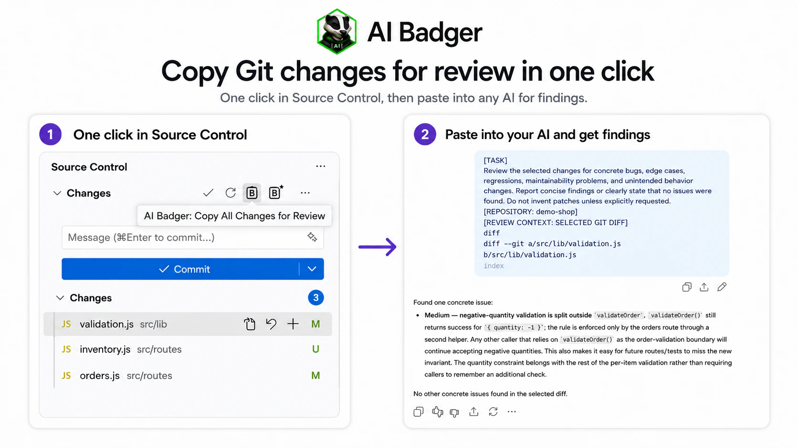
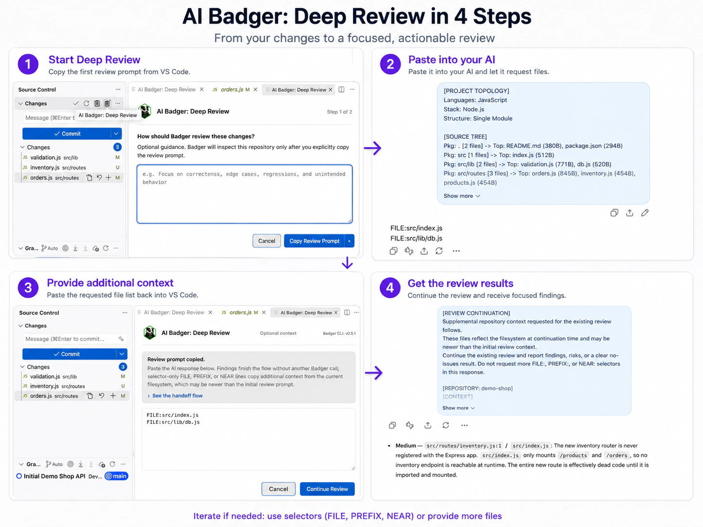

# AI Badger for VS Code


Review Git changes and copy focused code context into ChatGPT, Claude, Gemini, Grok, or any other AI chat, directly from VS Code.

Start with **Copy All Changes for Review** to prepare your Git changes for an AI review, or select files in the Explorer and use **Copy File for AI** or **Copy Selected Files for AI**. Paste the result into your preferred AI chat.

**The Badger CLI is optional.** Direct Git review (selected, repository, or workspace changes) and direct file copying work with the extension alone. Install the CLI for complementary repository-aware workflows: **Deep Review** and guided **Ask About** commands.

**Local-first · AI-provider independent · No automatic uploads**

[▶ Try the AI Badger VS Code Demo](https://pvrlabs.xyz/aibadger/vscode-demo.html)

[Read: Reviewing AI-Generated Code in VS Code with AI Badger](https://pvrlabs.xyz/articles/reviewing-ai-generated-code-vscode-aibadger.html)

## Why AI Badger?

- **Review-first workflow:** Review selected changes, all changes in a repository, or changes across the workspace.
- **Repository-aware review:** Deep Review uses the local Badger CLI to add focused topology and source context when needed.
- **Direct file copying:** Copy selected files with project-relative paths into any AI chat, without the CLI.
- **Focused context:** Give your AI chat the relevant code and a clear question instead of the whole repository.
- **Local-first processing:** Review and context preparation happen in VS Code or through the CLI on your machine.

## How it works

- **Review changes:** From Source Control, [copy all changes](#copy-all-changes-for-review) for a direct review request or use [Deep Review](#deep-review) when repository-aware context is needed, then paste the request into your AI chat.
- **Copy files:** Select files in the Explorer, [copy them with project-relative paths](#copy-files-for-an-ai-chat), and paste them into your AI chat.
- **Ask about code:** Start from a project, folder, file, or selection and use the [guided smart-context workflow](#ask-about-your-code).

## Install

1. Install **AI Badger** from the [Visual Studio Marketplace](https://marketplace.visualstudio.com/items?itemName=pvrlabs.ai-badger).
2. For Git review, open a Git repository in desktop VS Code. In Source Control, choose **AI Badger: Copy All Changes for Review**, then paste the request into your AI chat.
3. To share specific code, select files in the Explorer, right-click, and choose **AI Badger: Copy File for AI** or **AI Badger: Copy Selected Files for AI**.

Both workflows work immediately without the Badger CLI. The extension is desktop-only; it is not a `vscode.dev` web extension.

### Optional: add repository-aware workflows

The local [AI Badger CLI](https://github.com/PVRLabs/aibadger) is a complementary tool for **Deep Review** and guided **Ask About** workflows. Install it when you want the extension to prepare relevant repository context beyond the changes or files you select:

```bash
brew install pvrlabs/tap/badger
```

For Windows and other installation methods, see the [AI Badger installation guide](https://github.com/PVRLabs/aibadger/blob/main/docs/install.md).

## What you can do

Review workflows are the primary use case. Start in Source Control with **Copy All Changes for Review**. Use **Copy Selected Changes for Review** for a narrower scope or **Deep Review** when repository-aware context is needed; the detailed review flows are described below. The Explorer workflows remain useful when you already know which code to share or want to ask a broader question.

### Copy files for an AI chat

Use these commands when you already know which files should be included. AI
Badger formats the selected files with their project-relative paths and copies
them immediately. Nothing is shared until you paste it.

| Icon | Explorer action | Scope |
| --- | --- | --- |
|  | **AI Badger: Copy File for AI** | One selected file. |
|  | **AI Badger: Copy Selected Files for AI** | Multiple selected files. |

### Ask about your code

Use these commands to start the smart-context workflow for a specific scope. These commands require the local Badger CLI.

* **AI Badger: Ask About Project** — Start with the entire open project as the available scope.
* **AI Badger: Ask About Folder** — Focus the workflow on the selected folder and its contents.
* **AI Badger: Ask About File…** — Ask a question about one selected file, with relevant repository context available when needed.
* **AI Badger: Ask About Selected Files…** — Start from multiple files selected in the Explorer.

The project command is available from the Explorer toolbar. File and folder commands are available from Explorer and editor context menus where applicable. You can also find most commands in the Command Palette.

### Copy selected changes for review

In a Git repository, select one or more changed files in Source Control, right-click, and choose **AI Badger: Copy Selected Changes for Review**. The extension copies a review request with the selected files' complete Git diff and optional supporting text context. This works without the CLI; paste the request into your AI chat to review just those changes.

### Copy all changes for review

From a Git repository in the Source Control view, choose **AI Badger: Copy All Changes for Review**. The action copies one self-contained review request for that repository's current staged, unstaged, untracked, renamed, and deleted changes. It does not require the Badger CLI and never includes changes from another repository.



For a multi-repository workspace, choose **AI Badger: Copy Workspace Changes for Review** from the Command Palette or the aggregate **Changes** title. It copies one request covering every open Git repository with changes, keeping each repository's context in its own section. This also works without the CLI. If any repository cannot be prepared or the complete request does not fit, the clipboard is left unchanged.

These Git Source Control actions are available from the repository actions and
the **Changes** group. These commands require an explicit user action; nothing is sent
anywhere automatically.

| Icon | Source Control action | Current behavior |
| --- | --- | --- |
|  | **AI Badger: Copy All Changes for Review** | Copies the repository review request to the clipboard. |
|  | **AI Badger: Copy Workspace Changes for Review** | Copies all changed open Git repositories as one marked, repository-scoped request. |
|  | **AI Badger: Deep Review** | Opens editable guidance and, after Copy, asks local Badger for a topology-aware review request. |

For request size limits, repository labels, and file inclusion details, see the [review context guide](https://github.com/PVRLabs/aibadger-vscode/blob/main/docs/review-context.md).

### Deep Review



**AI Badger: Deep Review** requires the optional local Badger CLI. It opens editable guidance and, after Copy, prepares a review request with repository topology and source context. Paste the request into your AI chat to begin the review. Nothing is shared automatically.

Deep Review may receive final findings immediately. If the AI instead responds with only valid `FILE:`, `PREFIX:`, or `NEAR:` selectors, choose **Continue Review** to copy current supplemental context from the same repository. Findings-only responses finish locally; mixed or malformed responses remain editable. Supplemental context is stateless and may reflect newer filesystem state than the initial review request.

After a successful local Badger operation, the reusable assisted-flow header shows the detected Badger version. The indicator is best-effort and never appears before Badger has successfully run.

## Privacy

- Direct file copying reads only the selected files and writes the formatted context to your local clipboard.
- Direct repository and workspace review run locally in the extension, inspect only the explicitly targeted open Git repositories, and write one completed request to the clipboard only after every repository succeeds.
- Smart context invokes the local AI Badger CLI and does not upload your repository to PVR Labs.
- It does not bundle or host an AI model, and it does not require an AI-provider API key.
- You control what generated context is copied and pasted into ChatGPT, Claude, Gemini, Grok, or another external AI service.

Smart context sends selected paths and workflow input to the local CLI. If you deliberately paste generated context into an external AI service, that service receives what you pasted under its own terms.

## Configuration and troubleshooting

These CLI settings apply to Deep Review and guided Ask workflows. Direct Git review and file copying need no CLI setup.

- Verify the CLI with `badger --version`.
- If you installed the CLI while VS Code was open, restart VS Code so it can see the updated `PATH`.
- Set `aiBadger.executablePath` to the full path of `badger` when it is not on the expected `PATH`.
- If an operation is reported as incompatible, upgrade the AI Badger CLI.

See the [CLI compatibility guide](https://github.com/PVRLabs/aibadger-vscode/blob/main/docs/cli-compatibility.md) for capability requirements and executable resolution details.

## Support

- **Questions, ideas, and workflow discussion:** [AI Badger Discussions — VS Code Extension](https://github.com/PVRLabs/aibadger/discussions/categories/vs-code-extension).
- **Extension-specific bugs:** [AI Badger for VS Code Issues](https://github.com/PVRLabs/aibadger-vscode/issues), including Explorer commands, setup, webviews, and VS Code integration.
- **CLI-specific bugs:** [AI Badger CLI Issues](https://github.com/PVRLabs/aibadger/issues), including failures in CLI operations or context generated by the CLI.

## Development

```bash
npm ci
npm run verify
```

See the [release guide](https://github.com/PVRLabs/aibadger-vscode/blob/main/docs/releasing.md) for packaging and publishing details.

AI Badger for VS Code is published by [PVR Labs](https://github.com/PVRLabs).
